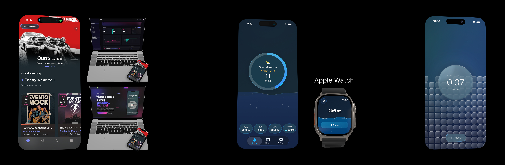

  

### Felipe Canhameiro

Senior iOS Developer & Mobile Lead · 19+ years building and shipping products end-to-end.

I design scalable mobile architectures, lead mobile platforms, and build products from concept to App Store. Currently leading the iOS ecosystem at [Wallife S.p.A.](https://wallife.com) with SwiftUI + Kotlin Multiplatform, and building [Prism Labs](https://prismlabs.studio), an indie studio for iOS apps with intentional design.

14 years at PerformaIT, a software consultancy where I worked as full-stack developer, delivery leader, and team manager across clients like Avianca, Continental, Groupe SEB, Ri Happy, Raízen, and BorgWarner.

Based in Turin, Italy.

---

**Stack:** Swift · SwiftUI · Kotlin · Jetpack Compose · Firebase · .NET · Angular · SQL Server · Oracle · Clean Architecture

**What I care about:** Architecture that survives scale. UI that feels physical, with spring physics, glass materials, and controlled motion. Products that respect the people who use them.

**How I work:** Modular systems over monoliths. Protocol-based contracts over tight coupling. Ship fast, but build for the next developer who reads the code.

---

**Projects:**

[**bandz**](https://github.com/fecanhameiro/bandz-showcase) · Live music discovery platform I built end-to-end: iOS (SwiftUI), Android (Compose), Cloud Functions v2, Next.js admin dashboard, Astro landing. Turborepo monorepo with shared types and Zod validation across all layers.

[**GlassWater**](https://github.com/fecanhameiro/glasswater-showcase) · Hydration tracker (iOS 26+). SwiftData, HealthKit, Live Activities, Dynamic Island, Watch app, 5 widget families. Liquid Glass design. [App Store](https://apps.apple.com/app/id6757977655).

[**GlassTime**](https://github.com/fecanhameiro/glasstime-showcase) · Focus timer (iOS 26+). Server-driven accuracy via Firebase Cloud Functions + APNs push. Live Activities with wall-clock precision.

---

[prismlabs.studio](https://prismlabs.studio) · [linkedin](https://linkedin.com/in/felipe-canhameiro)

